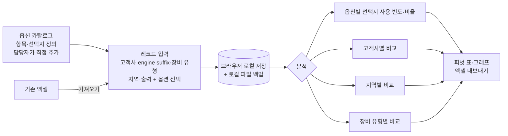

# 엔진 인터페이스 옵션 통합 관리·분석 도구 — 프로젝트 기획서

| 항목 | 내용 |
|---|---|
| 리포 | data09-19 |
| 제출자 | 장광희 |
| 직무·소속 | 엔진 개발연구원 / HD 건설기계 |
| 과정 | 현장 데이터 디지털화 전문가과정 1차수 |
| 작성일 | 2026-09-28 |
| 문서 상태 | 초안 v0.1 — 수강생 제출 자료 기반 |

---

## 1. 추진 배경과 현안

- 고객사에서 장비별로 요구하는 option(인터페이스 옵션)이 **15가지 정도** 정해져 있습니다.
- option별로 선택할 수 있는 항목은 **2~5가지씩 정도** 됩니다. 예를 들어 check engine lamp는 CAN type을 쓸 수도 있고 HW type을 쓸 수도 있습니다.
- 지금까지 다양한 고객사와 장비를 개발해 오면서 **보안을 위해 고객사별로 통합 관리하지 않았습니다.**
- 이제 내부 보안이 강화되어 고객사별 통합 관리가 가능해졌습니다. 이를 바탕으로 **한국·유럽·미국 등 지역별, 굴삭기·지게차·발전기 등 장비 유형별로 주로 쓰는 option 특성**을 파악하고, 추가 개선이 가능한 항목을 검토하려고 합니다.

현재는 옵션 정보가 프로젝트(고객사·장비)별 문서나 엑셀에 흩어져 있어, 여러 고객사를 가로질러 비교하기 어려운 것으로 보입니다(가정). 옵션 항목 자체도 앞으로 늘어날 수 있어 **항목을 담당자가 직접 추가할 수 있어야** 합니다.

## 2. 목표

### 2.1 최종 목표

- 고객사·장비별 인터페이스 옵션 선택 내역을 **한 곳에서 통합 관리**하는 도구
- **고객사·지역·장비 유형별로 많이 사용하는 옵션**을 표와 그래프로 보여 주어, 표준화·개선 후보 옵션을 찾는 데 쓰는 분석 화면

### 2.2 1차 개발 목표

- **옵션 카탈로그(항목·선택지 정의)를 화면에서 직접 추가·수정**할 수 있는 브라우저 도구를 먼저 만듭니다. 코드를 고치지 않고 담당자가 항목을 늘릴 수 있게 하는 것이 핵심입니다.
- 카탈로그를 기준으로 **고객사·engine suffix·장비 유형·지역·출력 등 레코드를 입력**하고, **엑셀로 가져오기·내보내기**합니다.
- **고객사·지역·장비 유형별 옵션 사용 빈도·비율**을 피벗 표와 막대그래프로 보여 줍니다.
- 모든 데이터는 **브라우저와 로컬 파일 안에만** 두어 고객사 정보가 외부로 나가지 않게 합니다.

## 3. 보유 데이터

| 데이터 | 형태 | 규모·주기 | 비고(민감도 등) |
|---|---|---|---|
| 고객사·장비별 인터페이스 옵션 내역 | 형태 미상(엑셀·사양 문서로 가정) | 항목 15개 정도, 항목별 선택지 2~5가지 정도. 레코드(고객사×장비) 수 미상 | **고객사 정보 — 보안 대상.** 지금까지 고객사별로 분리 관리해 왔음 |
| 옵션 항목 목록 | 담당자 정의 | 15개 정도, 추후 담당자가 임의로 추가 | 제출 원문 예시: 고객사, engine suffix, 장비 유형, 출력, ATS type, CAN SA, Pedal type, starter control type 등 |

제출 원문의 항목 중 **고객사·engine suffix·장비 유형·출력**은 레코드를 구분하는 기본 정보로, **ATS type·CAN SA·Pedal type·starter control type·check engine lamp** 등은 선택지를 고르는 옵션으로 나누어 다룹니다(가정). 지역(한국·유럽·미국 등)은 원문 현안에 나오지만 항목 목록에는 없어, 기본 정보에 추가하는 것으로 봅니다(가정).

제출 원문에 첨부 파일은 없습니다. 실제 항목·선택지 목록과 기존 정리 파일 형태를 받아야 카탈로그 초기값을 확정할 수 있습니다(10장).

## 4. 해결 방안 개요

| 단계 | 내용 |
|---|---|
| 수집 | 고객사·장비별 옵션 내역(기존 엑셀·사양 문서) |
| 정리 | 옵션 카탈로그(항목·선택지)를 정의하고, 레코드를 카탈로그 선택지로 맞춰 입력(표기 흔들림 통일) |
| 분석 | 고객사·지역·장비 유형·출력 구간별 선택지 사용 건수와 비율, 교차 비교 |
| AI | 분석 결과를 요약하고 표준화·개선 후보 옵션을 문장으로 정리 (확장, 보안 허용 시) |
| 산출물 | 옵션 통합 관리 표, 분석 피벗·그래프, 엑셀 보고서 |

## 5. 주요 기능

| 기능 | 설명 | 우선순위 |
|---|---|---|
| 옵션 카탈로그 편집 | 항목(예: check engine lamp) 추가·수정·순서 변경, 항목별 선택지(예: CAN type / HW type) 추가·수정. 항목 사용 중지(삭제 대신 숨김)로 과거 기록 보존 | MVP |
| 기본 정보 항목 편집 | 고객사·engine suffix·장비 유형·지역·출력 등 레코드 구분 항목도 목록으로 관리(장비 유형·지역은 선택 목록) | MVP |
| 레코드 입력·수정 | 고객사×장비 1건을 한 줄로 입력. 옵션은 카탈로그 선택지 중에서 고르게 해 표기를 통일. 검색·필터·복제 입력 | MVP |
| 엑셀 가져오기 | 기존 엑셀을 읽어 열을 카탈로그 항목에 연결(열 매핑 화면). 카탈로그에 없는 값은 「새 선택지로 추가 / 기존 선택지로 연결」을 고르게 함 | MVP |
| 엑셀 내보내기 | 레코드 전체와 카탈로그, 분석 결과를 엑셀로 저장 | MVP |
| 옵션 사용 빈도·비율 분석 | 옵션 항목별로 각 선택지가 몇 건·몇 %인지 표와 막대그래프로 표시 | MVP |
| 기준별 피벗 | 고객사·지역·장비 유형(추가로 출력 구간)을 기준으로 골라, 기준별 선택지 사용 비율을 피벗 표와 누적 막대그래프로 비교 | MVP |
| 로컬 저장·백업 | 브라우저 저장소에 자동 보관 + 전체 데이터를 로컬 파일(JSON 또는 엑셀)로 백업·복원 | MVP |
| 변경 이력 | 카탈로그·레코드 수정 시 언제 무엇이 바뀌었는지 기록 | 확장 |
| 옵션 조합 분석 | 함께 선택되는 옵션 조합(예: 특정 CAN SA와 Pedal type)의 빈도 | 확장 |
| 표준 사양 후보 추천 | 지역·장비 유형별로 대부분이 고르는 선택지를 「표준 후보」로 표시 | 확장 |
| AI 요약 | 분석 결과(집계 숫자만)를 개선 검토 문장으로 정리 | 확장 (외부 AI 허용 시) |

## 6. 기대 산출물

1. **옵션 통합 관리 도구(브라우저)** — 카탈로그 편집, 레코드 입력, 엑셀 가져오기·내보내기
2. **옵션 카탈로그** — 항목 15개 정도와 항목별 선택지 정의표(담당자가 계속 확장)
3. **옵션 사용 분석 화면** — 고객사·지역·장비 유형별 사용 빈도·비율 피벗과 그래프
4. **분석 엑셀 보고서** — 개선 검토 회의용 내보내기 파일

## 7. 기술 구성

| 과정 도구 | 이 프로젝트에서 쓰는 곳 |
|---|---|
| DAY1 암묵지 자산화·전략기획 | 담당자가 알고 있는 「지역·장비별로 보통 이렇게 간다」는 경험을 옵션 카탈로그와 분석 기준으로 꺼내 적기 |
| DAY2 코랩(Python)·바이브코딩 | 카탈로그 편집·입력·집계 화면 제작 — 이 프로젝트의 중심 |
| DAY3 멀티모달 비정형 정보화 | (필요 시) 고객사 사양서·요구서 문서에서 옵션 선택 내역 추출 |
| DAY4 RAG (Dify, NotebookLM) | 옵션별 설계 배경·사양서를 근거로 「왜 이 선택지를 쓰는가」 질의 (확장, 보안 허용 시) |
| DAY5 Make 자동화 | 정기 옵션 사용 현황 보고서 배포 (확장, 보안 허용 시) |
| 생성형 AI | 분석 결과 요약, 개선 후보 정리 보조 |

**개발 형태(권장)**

- **설치 없이 브라우저에서 도는 정적 웹 도구**로 만듭니다. 데이터는 **브라우저 저장소와 담당자 PC의 로컬 파일에만** 두고 서버·클라우드로 보내지 않으므로 **고객사 정보가 외부로 나가지 않습니다.** 원문에서 보안을 이유로 통합 관리를 미뤄 왔다고 했으므로 이 점을 가장 우선합니다.
- 집계는 건수·비율 계산이라 AI 서비스가 필요 없습니다.
- 브라우저 저장소는 브라우저 데이터를 지우면 함께 사라지므로, **로컬 파일 백업을 기본 작업 흐름**으로 둡니다. 여러 사람이 함께 쓰려면 사내 공유 폴더의 파일을 주고받는 방식을 먼저 검토합니다(가정 — 사내 보안 기준 확인 필요).
- AI 요약은 고객사명을 뺀 집계 숫자만 넘기는 방식으로 선택 기능으로 둡니다(외부 AI 사용 허용 여부 확인 필요).

## 8. 개발 단계

### 1단계 — 지금 바로 개발 가능한 부분

항목 구성이 담당자 정의로 바뀔 수 있다는 점이 원문의 핵심 요구이므로, **실제 항목 목록을 받기 전에도 카탈로그를 편집할 수 있는 구조**로 먼저 만들 수 있습니다.

- 옵션 카탈로그 편집 화면(항목·선택지 추가·수정·숨김) — 초기값은 원문 예시(ATS type, CAN SA, Pedal type, starter control type, check engine lamp: CAN type / HW type)로 채움
- 레코드 입력 화면(고객사·engine suffix·장비 유형·지역·출력 + 옵션 선택)
- 엑셀 가져오기(열 매핑)·내보내기
- 옵션별 사용 빈도·비율, 고객사·지역·장비 유형별 피벗 표와 그래프
- 브라우저 로컬 저장과 로컬 파일 백업·복원
- 시험용으로는 가상의 고객사·장비 레코드를 만들어, 일부러 지역·장비 유형별로 치우친 선택을 넣어 분석 화면이 그 차이를 보여 주는지 확인합니다.

### 2단계

- 실제 옵션 항목·선택지 목록과 기존 엑셀로 카탈로그 초기값·가져오기 보정
- 옵션 조합 분석, 출력 구간별 분석
- 변경 이력 기록, 표준 사양 후보 표시

### 3단계

- 개선 검토 결과(표준화 제안 등)를 레코드에 연결해 관리
- AI 요약 보고서, 사양서 기반 질의(Dify), 정기 보고서 배포(Make) — 모두 사내 보안 기준 허용 범위 안에서

## 9. 기대 효과

- **옵션 정보 통합** — 고객사별로 흩어져 있던 옵션 선택 내역을 같은 기준으로 한 곳에 모읍니다.
- **지역·장비 유형별 특성 파악** — 어느 지역·장비에서 어떤 선택지를 주로 쓰는지 표와 그래프로 바로 확인합니다.
- **개선·표준화 검토 근거 확보** — 사용이 드문 선택지나 한쪽으로 몰린 옵션을 찾아 개선 후보를 검토하는 근거가 됩니다.
- **항목 확장 용이** — 새 옵션 항목이 생겨도 코드 수정 없이 담당자가 바로 추가합니다.
- **보안 유지** — 데이터가 브라우저와 로컬 파일 밖으로 나가지 않습니다.

제출 자료에는 정량 수치가 없어 이 문서도 수치를 적지 않습니다.

## 10. 확인 필요 사항

**샘플 데이터 (필수)**

1. 옵션 항목 15개 정도의 전체 목록과 항목별 선택지(2~5가지 정도) — 실제 이름 그대로
2. 기존에 옵션 내역을 정리해 둔 파일이 있다면 그 형태(엑셀 열 구성, 한 파일에 한 고객사인지 등). 고객사명은 가려도 됩니다.
3. 레코드 1건의 단위 — 「고객사 × 장비 모델」인지, 「고객사 × engine suffix」인지, 프로젝트 단위인지

**항목 정의**

4. 지역 구분 기준 — 한국·유럽·미국 외에 어떤 지역이 있는지, 고객사 소재지인지 장비 판매 지역인지
5. 장비 유형 목록 — 굴삭기·지게차·발전기 외 전체 목록
6. 출력을 구간(예: kW 범위)으로 묶어 분석해야 하는지, 묶는다면 구간 기준
7. 한 옵션에 여러 선택지를 동시에 쓰는 경우가 있는지(예: CAN type과 HW type 병행)
8. 「추가 개선 가능한 항목」 검토에서 보고 싶은 관점 — 사용이 드문 선택지 정리, 지역별 표준 사양 도출 등

**보안·환경**

9. 통합 관리 데이터를 어디에 둘 수 있는지 — 담당자 PC만인지, 사내 공유 폴더·사내 서버까지 가능한지
10. 여러 사람이 함께 입력·조회해야 하는지(혼자 쓰는 도구인지)
11. 외부 AI 서비스에 집계 결과(고객사명 제외)를 넘겨도 되는지

## 부록. 제출 원문 요약

| 출처 | 파일·게시물 | 내용 |
|---|---|---|
| 패들릿 게시물 1 (2026-09-28T08:31) | 「interface 옵션화」 — `기획_원문.md` | 직무·소속(엔진 개발연구원 / HD 건설기계), 현안(고객사별 option 15가지 정도·선택지 2~5가지 정도를 보안 강화에 맞춰 통합 관리하고 지역·장비 유형별 특성 파악), 보유 데이터(고객사, engine suffix, 장비 유형, 출력, ATS type, CAN SA, Pedal type, starter control type 등 15개 정도 항목, 항목은 추후 임의 추가 필요), 기대 산출물(고객사·지역·장비 타입별 많이 사용하는 옵션 표시) |

첨부 파일은 제출되지 않았습니다(`attachments.json` 비어 있음).
